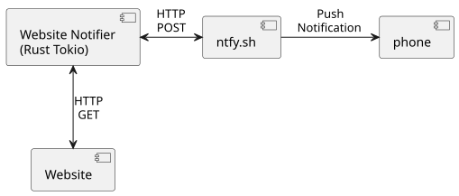

# Website Notifier in Rust and Tokio

# Introduction
This checks lists of URLs to see if the websites are up or down and it sends notifications accordingly.
This follows my work on a simple power notifier utility.

# Goals
* phone notification when a website goes down
* phone notification when a down website comes back up
* timestamps for events
* use Rust and Tokio to continue my learning and sharpen my skills

# Notification
The notification has:
* DOWN or UP
* URL
* timestamp for the event

For example:
```DOWN https://slashdot.org 2026-02-01 17:07:13```

# Implementation
I used Rust and Tokio to build a small daemon that runs when the system boots.
The daemon can started with systemd, launchd, or a variety of other methods depending on the target system.
Here is a diagram of the daemon and everything it interacts with.



# CLI Arguments
CLI arguments are:
* ntfy.sh url
* one or more urls to check

# Behavior
All of the URLs to check are checked hourly, which is adequate for my purposes.
The check frequency can be adjusted in the code if necessary.

Notifications are sent when website state changes from up to down or down to up.
If there is a problem sending the notification, the program retries every minute.

